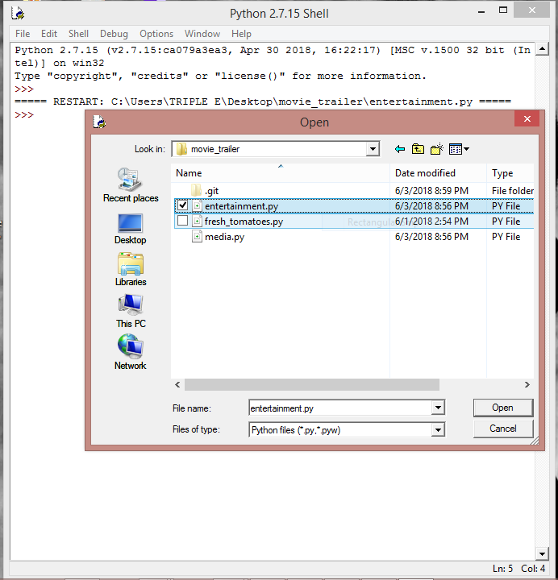
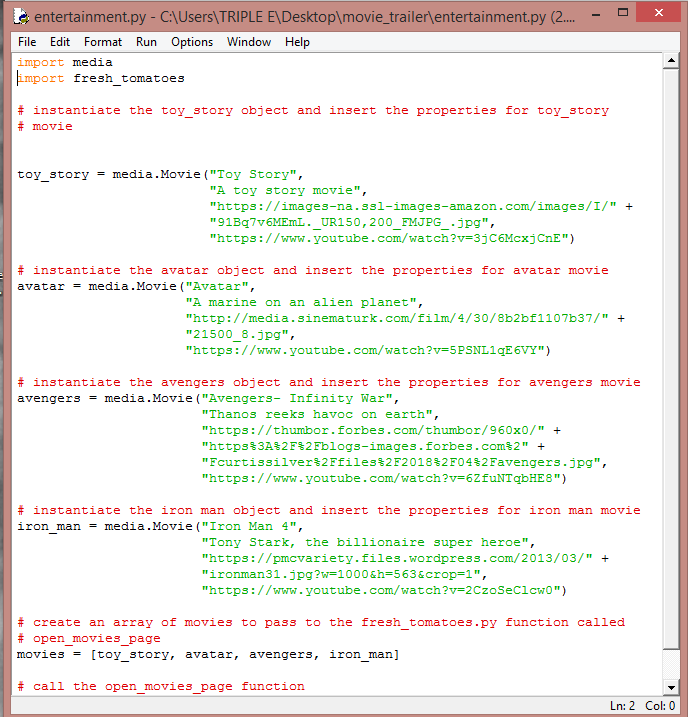
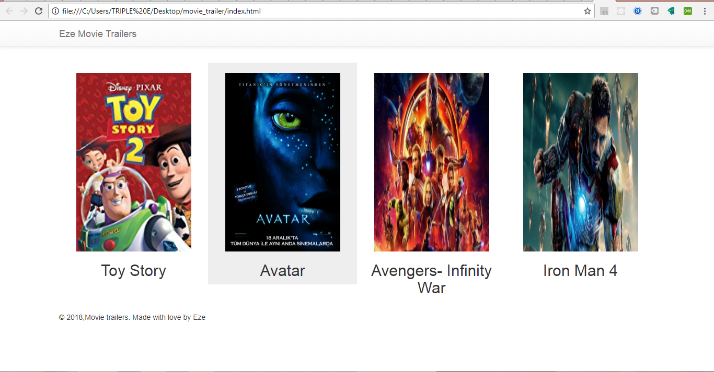

This project is connected to the Programming Foundations with Python course, but depending on your background knowledge you may not need the entirety of the course to complete this project. Here's what you should do:

1. Download python from the [official website](https://www.python.org/).
2. Install Python.
3. Clone this repository to your desktop.
3. Open IDLE (a built-in python editor that comes with python installation).
4. Use IDLE to open the `entertainment.py` in the cloned repository on your desktop.

5. Run the module from the Run window, then click run module or press F5 on your keyboard.

4. Output should be the following in a browser window.

